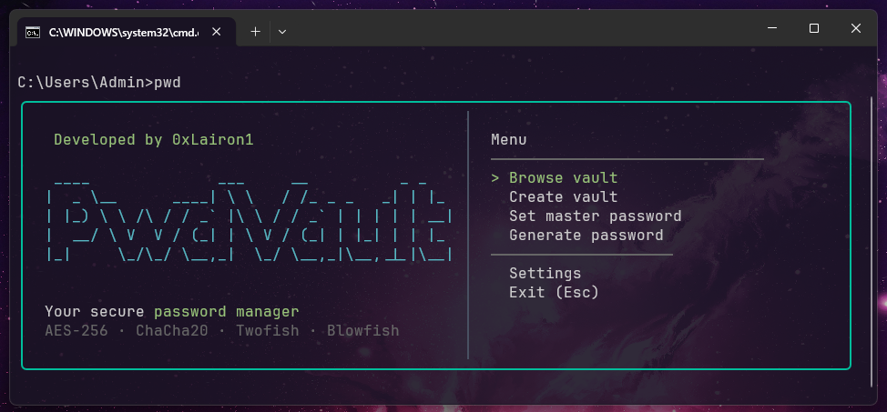

# PasswordVault



**PasswordVault** — консольный менеджер паролей с терминальным интерфейсом, написанный на TypeScript. Приложение позволяет безопасно хранить пароли, логины, TOTP-секреты и произвольные данные в зашифрованных хранилищах (vaults), организованных в иерархические коллекции. Поддерживается выбор из четырёх алгоритмов шифрования: AES-256-GCM, ChaCha20-Poly1305, Twofish-CTR и Blowfish-CBC.

### Возможности

- Создание и управление хранилищами паролей с иерархической структурой коллекций
- Шифрование каждого хранилища индивидуальным паролем и выбранным алгоритмом
- Генерация TOTP-кодов (двухфакторная аутентификация) прямо в терминале
- Мастер-пароль для быстрой расшифровки без повторного ввода
- Копирование логина, пароля и TOTP-кода в буфер обмена
- Встроенный генератор паролей с настраиваемой длиной и набором символов
- Мультиязычность — поддержка русского и английского интерфейса с выбором при первом запуске и переключением в настройках
- Кроссплатформенность (Windows, macOS, Linux)

---

## Установка

### Требования

- [Node.js](https://nodejs.org/) версии 18 или выше
- npm (поставляется вместе с Node.js)

### Шаги установки

```bash
# 1. Клонируйте репозиторий
git clone https://github.com/your-username/PasswordVault.git
cd PasswordVault

# 2. Установите зависимости
npm install

# 3. Соберите проект
npm run build

# 4. Запустите приложение
npm start
```

### Глобальная установка как CLI-команда

Чтобы использовать приложение как команду `pwd` из любого места в терминале:

```bash
npm install -g .
```

После этого приложение доступно по команде:

```bash
pwd
```

### Доступные скрипты

| Команда         | Описание                           |
|-----------------|------------------------------------|
| `npm run build` | Компиляция TypeScript в JavaScript |
| `npm start`     | Запуск скомпилированного приложения |
| `npm run run`   | Сборка и запуск одной командой     |
| `npm run dev`   | Режим наблюдения (watch mode)      |

---

## Хранение данных

Зашифрованные файлы и конфигурация хранятся в платформозависимой директории:

| Платформа | Путь                                            |
|-----------|-------------------------------------------------|
| Windows   | `%APPDATA%\PasswordVault\`                      |
| macOS     | `~/Library/Application Support/PasswordVault/`  |
| Linux     | `~/.config/PasswordVault/`                      |

- Хранилища сохраняются как `.crypto` файлы в подпапке `vault/`
- Настройки (выбранный язык) сохраняются в `config.json`

---

## Локализация (i18n)

Приложение поддерживает два языка интерфейса:

| Язык     | Код |
|----------|-----|
| English  | `en` |
| Русский  | `ru` |

- При первом запуске отображается экран выбора языка
- Язык можно переключить в любой момент через **Меню → Настройки**
- Выбор сохраняется в `config.json` и применяется при следующем запуске
- Все строки интерфейса вынесены в JSON-файлы (`src/i18n/ru.json`, `src/i18n/en.json`)

---

## Архитектура и технологии

### Стек технологий

| Технология        | Назначение                                  |
|-------------------|---------------------------------------------|
| TypeScript        | Язык разработки со строгой типизацией       |
| React 19          | Построение компонентов терминального UI      |
| Ink 6             | React-рендерер для терминала                |
| Awilix            | Dependency Injection контейнер              |
| Node.js Crypto    | AES-256-GCM, ChaCha20-Poly1305, Blowfish   |
| twofish-ts        | Реализация алгоритма Twofish                |
| Figlet            | ASCII-арт логотип                           |

### Структура проекта

```
src/
├── index.tsx                   # Точка входа CLI-приложения
├── container.ts                # Настройка DI-контейнера (Awilix)
├── i18n/                       # Файлы локализации
│   ├── ru.json                 # Русские строки интерфейса
│   └── en.json                 # Английские строки интерфейса
├── dto/                        # Data Transfer Objects
│   ├── vault.dto.ts            # Vault, VaultCollection, VaultContent
│   └── algorithm.type.ts       # Enum алгоритмов шифрования
├── error/                      # Кастомные ошибки
│   ├── vault.errors.ts
│   └── crypto-file.errors.ts
├── service/                    # Сервисный слой
│   ├── vault.service.ts        # Интерфейс VaultService
│   ├── crypto-file.service.ts  # Интерфейс CryptoFileService
│   ├── config.service.ts       # Интерфейс ConfigService (настройки)
│   ├── locale.service.ts       # Интерфейс LocaleService (i18n)
│   ├── password-generation.service.ts
│   └── impl/                   # Реализации сервисов
├── strategy/                   # Стратегии шифрования (Strategy Pattern)
│   ├── сrypto.strategy.ts      # Базовый интерфейс CryptoStrategy
│   └── impl/                   # AES, ChaCha20, Twofish, Blowfish
├── ui/                         # Терминальный интерфейс
│   ├── App.tsx                 # Главный компонент, стек экранов
│   ├── components/             # SelectList, TextInput, Notification, LeftPanel
│   ├── hooks/                  # useAppState, useClipboard, useLocale
│   └── screens/                # Экраны приложения (9 штук)
└── utils/
    └── app.utils.ts            # Утилиты: пути, TOTP-генерация
```

### Архитектурные паттерны

- **Strategy Pattern** — каждый алгоритм шифрования реализует единый интерфейс `CryptoStrategy` с методами `encrypt`/`decrypt`, что позволяет легко добавлять новые алгоритмы
- **Dependency Injection** — сервисы и стратегии регистрируются в Awilix-контейнере и внедряются через конструктор
- **Screen Stack Navigation** — навигация между экранами реализована через стек, аналогично мобильным приложениям

### Алгоритмы шифрования

Все алгоритмы используют **Scrypt** для деривации ключа (N=16384, r=8, p=1), что обеспечивает устойчивость к GPU/ASIC атакам.

| Алгоритм           | Режим | Аутентификация    | Длина ключа | Nonce/IV  |
|---------------------|-------|-------------------|-------------|-----------|
| AES-256-GCM         | GCM   | Встроенная (AEAD) | 256 бит     | 12 байт   |
| ChaCha20-Poly1305   | AEAD  | Встроенная (AEAD) | 256 бит     | 12 байт   |
| Twofish-CTR         | CTR   | HMAC-SHA256       | 256 бит     | 16 байт   |
| Blowfish-CBC        | CBC   | HMAC-SHA256       | 256 бит     | 8 байт    |

### Формат зашифрованного файла

```json
{
  "appTag": "PASSWORD_VAULT_ENCRYPTED_FILE",
  "algorithm": "AES-256-GCM",
  "securedData": "<base64-encoded encrypted data>"
}
```

Внутри `securedData` закодированы: соль, nonce/IV, тег аутентификации (или HMAC) и шифротекст.

---

## Автор

Developed by **0xLairon1**
